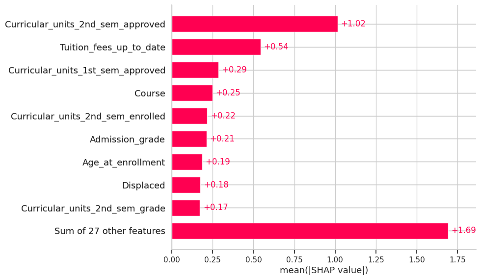

# Proyek Akhir: Menyelesaikan Permasalahan Perusahaan Edutech

- **Nama:** Putra Andika Pradana
- **Email:** putraandika166@gmail.com
- **ID Dicoding:** puth88

---

## Business Understanding
Jaya Jaya Institut merupakan salah satu institusi pendidikan tinggi yang telah berdiri sejak tahun 2000 dan memiliki reputasi yang baik dalam mencetak lulusan berkualitas. Namun demikian, institusi ini masih menghadapi permasalahan serius berupa **tingginya angka mahasiswa yang tidak menyelesaikan studi (dropout)**.

Tingginya angka dropout dapat berdampak negatif terhadap reputasi institusi, akreditasi, efektivitas operasional, serta kepercayaan masyarakat. Oleh karena itu, pihak Jaya Jaya Institut ingin **mengidentifikasi mahasiswa yang berpotensi dropout sedini mungkin** agar dapat diberikan intervensi dan pendampingan yang tepat.

Melalui proyek data science ini, dibangun sebuah solusi berbasis data untuk membantu institusi dalam memahami pola dropout dan menyediakan sistem prediksi sebagai alat bantu pengambilan keputusan.

---

### Permasalahan Bisnis
Permasalahan bisnis yang ingin diselesaikan dalam proyek ini meliputi:

1. **Mengidentifikasi faktor-faktor utama yang memengaruhi risiko dropout mahasiswa**, baik dari sisi akademik, keuangan, demografi, maupun latar belakang pendidikan.
2. **Menganalisis pola karakteristik mahasiswa yang cenderung mengalami dropout**, terutama berdasarkan performa akademik di awal perkuliahan dan status pembayaran biaya kuliah.
3. **Menyediakan sistem pendukung keputusan berupa dashboard dan model prediksi**, sehingga pihak institusi dapat melakukan intervensi secara proaktif dan tepat sasaran.

Dengan menyelesaikan permasalahan tersebut, Jaya Jaya Institut diharapkan mampu:
- Menurunkan **angka dropout mahasiswa**.
- Meningkatkan **tingkat kelulusan**.
- Menjaga **reputasi dan kualitas akademik** institusi.

---

### Cakupan Proyek
Lingkup pekerjaan dalam proyek ini mencakup:

1. **Data Preparation dan Data Quality Check**  
   Memastikan kualitas data melalui pengecekan missing value, validasi nilai, dan penanganan outlier menggunakan pipeline preprocessing.

2. **Exploratory Data Analysis (EDA)**  
   Melakukan eksplorasi data secara mendalam untuk menemukan pola, tren, dan hubungan antar variabel yang berkaitan dengan risiko dropout.

3. **Pengembangan Model Machine Learning**  
   Membangun dan membandingkan beberapa algoritma machine learning (Logistic Regression, Random Forest, dan XGBoost), serta melakukan hyperparameter tuning untuk memperoleh model terbaik.

4. **Interpretasi Model**  
   Menggunakan metode SHAP untuk menjelaskan faktor-faktor yang paling berpengaruh terhadap prediksi dropout.

5. **Deployment Model**  
   Mengimplementasikan model ke dalam aplikasi prototype berbasis Streamlit dan menyediakan script batch prediction untuk penggunaan operasional.

6. **Rekomendasi Action Items**  
   Memberikan rekomendasi yang dapat ditindaklanjuti berdasarkan hasil analisis dan model.

---

### Persiapan

**Sumber Data:**  
Students’ Performance Dataset (Higher Education Institution)
Link: https://github.com/dicodingacademy/dicoding_dataset/blob/main/students_performance/README.md

Setup environment dan menjalankan project:
```
1. Membuat virtual environment
   ```bash
   python -m venv venv

2. Mengaktifkan virtual environment
venv\Scripts\activate

3. Menginstal seluruh dependency
pip install -r requirements.txt

4. Jalankan app.py jika ingin melakukan prediction model berbasis aplikasi prototype dengan streamlit
streamlit run app.py

5. Jalankan Predicition.py jika ingin melakukan batch predicition langsung pada file csv
python Prediction.py

```

## Business Dashboard
Dashboard dikembangkan untuk membantu pihak institusi dalam memantau performa mahasiswa dan faktor risiko dropout secara visual dan mudah dipahami.

Dashboard menampilkan:
- Distribusi status mahasiswa (Graduate, Enrolled, Dropout)
- Hubungan antara status pembayaran biaya kuliah dan dropout
- Performa akademik semester 1 dan 2
- Distribusi usia saat pendaftaran
- Dashboard dirancang dengan visualisasi yang informatif dan ramah bagi pengguna non-teknis.

### Model Machine Learning yang Digunakan

Pada proyek ini dilakukan evaluasi terhadap tiga algoritma machine learning, yaitu
**Logistic Regression**, **Random Forest**, dan **XGBoost**.
Evaluasi tidak hanya berfokus pada nilai akurasi secara keseluruhan, tetapi juga
memperhatikan performa setiap kelas target, khususnya kelas **Dropout**.

Dari sudut pandang bisnis Jaya Jaya Institut, kesalahan yang paling kritikal adalah:
**mahasiswa yang benar-benar berisiko dropout namun tidak terdeteksi oleh sistem**.
Oleh karena itu, metrik utama yang dijadikan acuan adalah **Recall pada kelas Dropout**,
dengan dukungan metrik F1-score dan macro average.

---

#### Ringkasan Performa Kelas Dropout

| Model               | Precision | Recall | F1-score |
|---------------------|-----------|--------|----------|
| Logistic Regression | 0.79      | 0.76   | 0.78     |
| Random Forest       | 0.81      | 0.75   | 0.78     |
| XGBoost             | 0.80      | 0.74   | 0.77     |

Secara numerik, Logistic Regression memiliki nilai Recall tertinggi pada kelas Dropout.
Namun, selisih performa antar model relatif kecil sehingga diperlukan evaluasi
tambahan di luar satu metrik saja.

---

#### Pertimbangan Lanjutan dalam Pemilihan Model

##### 1. Kestabilan Performa Antar Kelas
XGBoost menunjukkan performa yang lebih seimbang di seluruh kelas target,
yang tercermin dari nilai **macro average F1-score tertinggi (0.71)**.
Hal ini menandakan bahwa model tidak hanya fokus pada satu kelas,
tetapi mampu melakukan generalisasi dengan lebih baik.

##### 2. Kemampuan Menangkap Pola Non-Linear
Data mahasiswa memiliki hubungan yang kompleks dan tidak linear, terutama antara:
- Performa akademik
- Kondisi sosial ekonomi
- Risiko dropout

Model berbasis tree seperti XGBoost lebih mampu menangkap interaksi non-linear tersebut
dibandingkan Logistic Regression yang mengasumsikan hubungan linear.

##### 3. Ketahanan terhadap Outlier
Pada kasus pendidikan, nilai ekstrem seperti:
- Nilai akademik yang sangat rendah
- Jumlah mata kuliah yang tidak diselesaikan
sering kali merepresentasikan kondisi mahasiswa berisiko tinggi, bukan kesalahan data.

XGBoost lebih robust terhadap outlier dibandingkan Logistic Regression,
sehingga lebih sesuai untuk karakteristik data ini.

##### 4. Interpretabilitas Model
XGBoost dapat diinterpretasikan dengan baik menggunakan metode SHAP,
yang memungkinkan institusi untuk:
- Mengetahui faktor utama penyebab risiko dropout
- Menyusun intervensi akademik dan finansial yang lebih tepat sasaran
- Mendukung pengambilan keputusan berbasis data secara transparan

---

### Keputusan Model Final

Meskipun Logistic Regression memiliki Recall sedikit lebih tinggi pada kelas Dropout,
**XGBoost dipilih sebagai model final** karena memberikan keseimbangan terbaik antara:

- Performa yang kompetitif dalam mendeteksi mahasiswa dropout
- Generalisasi yang lebih stabil pada seluruh kelas
- Kemampuan menangkap hubungan kompleks dalam data
- Ketahanan terhadap outlier
- Interpretabilitas yang tinggi melalui SHAP
- Kesiapan untuk digunakan dalam sistem produksi

Pemilihan ini memastikan bahwa solusi yang dibangun tidak hanya optimal secara teknis,
tetapi juga relevan dan berkelanjutan dari sisi bisnis.

---

### Implikasi Bisnis

Dengan menggunakan model XGBoost, Jaya Jaya Institut memperoleh sistem prediksi yang:
- Mendeteksi mahasiswa berisiko dropout lebih awal
- Mengurangi kemungkinan intervensi yang tidak tepat sasaran
- Memberikan insight yang dapat ditindaklanjuti oleh pihak akademik
- Mendukung strategi pencegahan dropout secara proaktif

Pendekatan ini diharapkan dapat membantu institusi menurunkan angka dropout
dan meningkatkan tingkat keberhasilan studi mahasiswa.

### Model Interpretability (SHAP)


**Interpretasi Model Menggunakan SHAP (Kelas Dropout)**

Visualisasi SHAP di atas menunjukkan fitur-fitur yang paling berpengaruh
dalam memprediksi risiko mahasiswa mengalami **dropout**.
Nilai pada sumbu horizontal merepresentasikan **mean(|SHAP value|)**,
yang menunjukkan seberapa besar kontribusi rata-rata suatu fitur
terhadap prediksi model.

**Insight Utama**

1. **Curricular_units_2nd_sem_approved**  
   Fitur ini memiliki pengaruh paling besar terhadap prediksi dropout.
   Mahasiswa dengan jumlah mata kuliah yang disetujui (lulus) pada semester kedua yang rendah
   secara signifikan meningkatkan risiko dropout.
   Hal ini menegaskan bahwa performa akademik berkelanjutan,
   terutama setelah semester pertama, merupakan indikator paling kuat.

2. **Tuition_fees_up_to_date**  
   Status pembayaran biaya kuliah menjadi faktor kedua paling berpengaruh.
   Mahasiswa yang memiliki tunggakan biaya kuliah cenderung lebih berisiko
   untuk tidak melanjutkan studi, menunjukkan bahwa faktor finansial
   memainkan peran penting selain faktor akademik.

3. **Curricular_units_1st_sem_approved**  
   Performa pada semester pertama juga berkontribusi signifikan.
   Mahasiswa yang sejak awal mengalami kesulitan akademik
   memiliki probabilitas dropout yang lebih tinggi di semester berikutnya.

4. **Course (Program Studi)**  
   Program studi tertentu menunjukkan pola risiko dropout yang berbeda.
   Hal ini dapat disebabkan oleh tingkat kesulitan kurikulum,
   beban akademik, atau karakteristik mahasiswa pada program studi tersebut.

5. **Curricular_units_2nd_sem_enrolled dan Curricular_units_2nd_sem_grade**  
   Jumlah mata kuliah yang diambil dan nilai rata-rata semester kedua
   memperkuat sinyal bahwa keterlibatan akademik dan performa belajar
   memiliki pengaruh langsung terhadap keberlangsungan studi mahasiswa.

6. **Admission_grade dan Age_at_enrollment**  
   Admission grade mencerminkan kesiapan akademik awal,
   sementara usia saat pendaftaran dapat merepresentasikan kondisi non-akademik
   seperti tanggung jawab pekerjaan atau keluarga,
   yang turut memengaruhi risiko dropout.

7. **Displaced**  
   Status mahasiswa yang mengalami perpindahan tempat tinggal
   juga memiliki kontribusi terhadap risiko dropout,
   kemungkinan berkaitan dengan tantangan adaptasi sosial dan ekonomi.

**Interpretasi Agregat Fitur**

Bagian *“Sum of 27 other features”* menunjukkan bahwa meskipun terdapat banyak fitur lain,
kontribusi individu masing-masing relatif kecil dibandingkan
faktor akademik utama dan kondisi finansial.
Hal ini menegaskan bahwa **dropout merupakan fenomena multifaktorial**,
namun didominasi oleh performa akademik dan stabilitas finansial mahasiswa.

**Kesimpulan Bisnis**

Hasil interpretasi SHAP menunjukkan bahwa:
- **Performa akademik semester pertama dan kedua** adalah sinyal paling awal dan paling kuat
  untuk mendeteksi risiko dropout.
- **Faktor finansial** berperan sebagai faktor pendukung yang signifikan.
- Intervensi paling efektif sebaiknya difokuskan pada:
  mahasiswa dengan performa akademik rendah dan/atau masalah pembayaran biaya kuliah.

Insight ini dapat digunakan oleh Jaya Jaya Institut
untuk merancang sistem peringatan dini (early warning system)
dan intervensi yang lebih tepat sasaran.


Berdasarkan analisis SHAP (mean |SHAP value|), fitur-fitur berikut
merupakan faktor paling berpengaruh dalam prediksi status mahasiswa.

| Rank | Fitur                             | Insight |
| ---: | --------------------------------- | ------- |
| 1 | Curricular_units_2nd_sem_approved | Jumlah mata kuliah yang lulus pada semester 2 merupakan indikator paling kuat terhadap keberlanjutan studi mahasiswa |
| 2 | Tuition_fees_up_to_date | Mahasiswa dengan status pembayaran biaya kuliah yang tidak lancar memiliki risiko dropout yang lebih tinggi |
| 3 | Curricular_units_1st_sem_approved | Performa akademik pada semester pertama menjadi sinyal awal risiko dropout |
| 4 | Course | Program studi tertentu memiliki tingkat risiko dropout yang berbeda |
| 5 | Curricular_units_2nd_sem_enrolled | Jumlah mata kuliah yang diambil pada semester kedua mencerminkan tingkat keterlibatan akademik mahasiswa |
| 6 | Admission_grade | Nilai masuk yang rendah menunjukkan kesiapan akademik awal yang lebih rendah |
| 7 | Age_at_enrollment | Mahasiswa dengan usia masuk yang lebih tinggi cenderung memiliki risiko dropout lebih besar |
| 8 | Displaced | Status mahasiswa pindahan berkontribusi terhadap risiko dropout |
| 9 | Curricular_units_2nd_sem_grade | Nilai akademik pada semester kedua turut memengaruhi prediksi risiko dropout |


---

## Menjalankan Sistem Machine Learning
Jelaskan cara menjalankan protoype sistem machine learning yang telah dibuat. Selain itu, sertakan juga link untuk mengakses prototype tersebut.
Link: 
```
Aplikasi Streamlit (Prototype)
Untuk menjalankan aplikasi prediksi secara lokal:
streamlit run app.py

Aplikasi ini memungkinkan pengguna memasukkan data mahasiswa dan memperoleh:
- Prediksi status mahasiswa
- Probabilitas masing-masing kelas

Batch Prediction (CSV)
Selain aplikasi interaktif, disediakan script Prediction.py untuk melakukan prediksi massal menggunakan file CSV.
python Prediction.py

Script ini akan menghasilkan file CSV baru dengan tambahan kolom:
- Predicted_Status
- Prob_Dropout
- Prob_Enrolled
- Prob_Graduate

```

## Conclusion

- Berdasarkan keseluruhan proses analisis data, eksplorasi, pemodelan machine learning, dan interpretasi model, dapat disimpulkan bahwa permasalahan dropout mahasiswa di Jaya Jaya Institut sangat dipengaruhi oleh kombinasi faktor akademik dan finansial, terutama pada fase awal hingga pertengahan masa studi.

- Hasil Exploratory Data Analysis (EDA) menunjukkan bahwa mahasiswa yang mengalami kesulitan akademik sejak semester pertama cenderung memiliki risiko dropout yang lebih tinggi. Pola ini semakin diperkuat oleh performa akademik pada semester kedua, yang menjadi indikator paling dominan terhadap keberlanjutan studi mahasiswa.

- Dari sisi pemodelan, beberapa algoritma machine learning telah diuji dan dibandingkan. Model XGBoost yang telah melalui proses hyperparameter tuning dipilih sebagai model final karena mampu memberikan keseimbangan terbaik antara performa deteksi mahasiswa dropout (Recall kelas Dropout), stabilitas performa antar kelas, serta kemampuan menangkap hubungan non-linear pada data.

- Interpretasi model menggunakan SHAP mengonfirmasi bahwa faktor-faktor akademik seperti jumlah mata kuliah yang lulus dan diambil pada semester pertama dan kedua, serta faktor finansial seperti status pembayaran biaya kuliah, memiliki pengaruh yang lebih besar dibandingkan faktor demografis semata.

- Selain itu, sanity check terhadap model menunjukkan bahwa prediksi yang dihasilkanbersifat logis dan konsisten secara bisnis, di mana perubahan pada performa akademik dan status pembayaran secara signifikan memengaruhi tingkat risiko dropout.

- Secara keseluruhan, solusi yang dibangun dalam proyek ini dinilai layak digunakan sebagai sistem pendukung keputusan (decision support system) untuk membantu Jaya Jaya Institut dalam melakukan deteksi dini mahasiswa berisiko dropout secara proaktif, transparan, dan berbasis data.


## Rekomendasi Action Items

Berdasarkan hasil analisis dan interpretasi model, berikut adalah beberapa rekomendasi
aksi yang dapat diterapkan oleh Jaya Jaya Institut untuk menurunkan angka dropout
mahasiswa secara berkelanjutan.

### 1. Intervensi Akademik Dini Berbasis Semester Pertama
Mahasiswa dengan jumlah mata kuliah lulus yang rendah pada semester pertama
perlu segera diidentifikasi dan diberikan pendampingan akademik sejak awal,
seperti:
- Program remedial atau kelas tambahan
- Bimbingan belajar terstruktur
- Monitoring berkala oleh dosen wali

Pendekatan ini penting karena performa akademik awal terbukti menjadi sinyal
paling awal dan konsisten terhadap risiko dropout.

---

### 2. Monitoring Ketat Performa Semester Kedua
Hasil SHAP menunjukkan bahwa performa akademik pada semester kedua merupakan
faktor paling dominan dalam prediksi dropout. Oleh karena itu, institusi disarankan
untuk:
- Menetapkan threshold jumlah mata kuliah lulus semester kedua sebagai indikator risiko
- Mengaktifkan sistem peringatan dini (early warning system)
- Melakukan evaluasi akademik menyeluruh sebelum mahasiswa melanjutkan semester berikutnya

Langkah ini memungkinkan intervensi dilakukan sebelum mahasiswa benar-benar
memutuskan untuk berhenti studi.

---

### 3. Penanganan Risiko Finansial Secara Proaktif
Status pembayaran biaya kuliah terbukti memiliki pengaruh signifikan terhadap
risiko dropout. Institusi dapat:
- Mengidentifikasi mahasiswa dengan tunggakan biaya sejak dini
- Menawarkan skema cicilan atau keringanan pembayaran
- Mengintegrasikan data keuangan dengan sistem monitoring akademik

Pendekatan ini dapat mencegah dropout yang disebabkan oleh kendala ekonomi,
bukan semata-mata kemampuan akademik.

---

### 4. Pendekatan Spesifik Berdasarkan Program Studi
Perbedaan risiko dropout antar program studi menunjukkan perlunya kebijakan
yang lebih kontekstual. Rekomendasi yang dapat diterapkan antara lain:
- Evaluasi kurikulum dan beban akademik pada program studi dengan risiko tinggi
- Penyediaan dukungan akademik khusus sesuai karakteristik program studi
- Analisis lanjutan untuk memahami faktor dropout spesifik per jurusan

---

### 5. Dukungan Khusus bagi Mahasiswa Usia Dewasa dan Mahasiswa Pindahan
Mahasiswa dengan usia masuk yang lebih tinggi serta mahasiswa pindahan
(displaced) cenderung memiliki tantangan tambahan. Institusi disarankan untuk:
- Menyediakan program orientasi khusus
- Menawarkan fleksibilitas jadwal atau metode pembelajaran
- Memberikan pendampingan adaptasi akademik dan administratif

Pendekatan ini membantu meningkatkan retensi mahasiswa dengan latar belakang non-tradisional.

---

### 6. Pemanfaatan Model sebagai Sistem Pendukung Keputusan
Model machine learning yang dibangun sebaiknya tidak digunakan sebagai alat
penentu keputusan tunggal, melainkan sebagai sistem pendukung keputusan, dengan:
- Menyajikan skor risiko dan probabilitas dropout
- Memberikan interpretasi faktor risiko melalui SHAP
- Mendukung dosen wali dan pihak akademik dalam pengambilan keputusan berbasis data

---

### 7. Evaluasi dan Pemutakhiran Model Secara Berkala
Untuk menjaga relevansi dan akurasi model, institusi perlu:
- Melakukan retraining model secara berkala dengan data terbaru
- Memantau perubahan pola dropout dari waktu ke waktu
- Menyesuaikan threshold risiko sesuai kebijakan institusi

Pendekatan ini memastikan bahwa sistem prediksi tetap adaptif terhadap
dinamika akademik dan sosial ekonomi mahasiswa.
